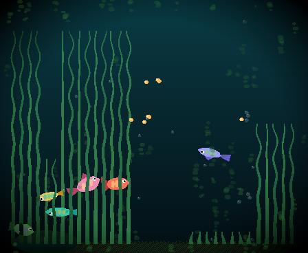
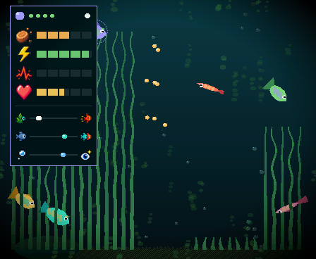
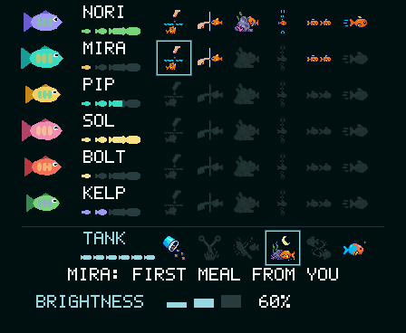

# pocket-tank 🐟

**A tiny language model keeps a fish tank alive on an $8 chip.**
The ESP32-S3 board, with screen and battery used in this project is actually around $35.

A 14-million-parameter transformer, distilled from a 26-billion-parameter
teacher, runs entirely on an ESP32-S3 microcontroller and makes every
high-level decision for a small aquarium of virtual fish: when to eat, hide,
explore, socialize, rest, or flee. No network. No cloud. The whole brain is a
7.56 MB file read straight from flash, and the tank lives on a 1.8-inch AMOLED
you can hold in one hand.



The fish aren't scripted. Each one periodically describes its situation to the
model as a single line of text (hunger, energy, fear, who's nearby, its own
personality) and the model completes the line with a goal and an urgency. A
reflex layer turns that goal into motion at 25 to 30 frames per second. When
the model isn't sure, the fish visibly *hesitates*.

```
zone 2 hunger 7 energy 5 stress 2 curiosity 8 bold 4 social 6 stage adult
trust 6 food near 12 shadow none friend mid 3 bubble mid 10 reef far 7
wall clear last explore time day  ->  seek_food urgency 8
```

This repo is the complete project: the trained model, the distillation
pipeline that made it, a PC simulator, and the firmware for a real board.
Got the board? **[Install it from your browser](https://stratobuilds.com/pocket-tank-installer/)**,
no toolchain needed.

## Contents

- [The numbers](#the-numbers)
- [How it's put together](#how-its-put-together)
- [What the fish do](#what-the-fish-do)
- [The living tank](#the-living-tank)
- [Try it: PC simulator](#try-it-pc-simulator)
- [Try it: firmware in QEMU](#try-it-firmware-in-qemu)
- [Install from your browser](#install-from-your-browser)
- [Run it on real hardware](#run-it-on-real-hardware)
- [The director console](#the-director-console)
- [Train your own](#train-your-own)
- [Layout](#layout)
- [Documentation](#documentation)
- [Status](#status)

## The numbers

| | Teacher | Student (what ships) |
|---|---|---|
| Model | gemma4:26b | pocket-tank 14.3M (dim 384, 8 layers, 8 heads) |
| Parameters | ~26,000,000,000 | 14,300,000, about 1,818× fewer |
| Size | ~18 GB (Q4_K_M) | 57 MB fp32 → **7.56 MB 4-bit** |
| Vocabulary | ~262K tokens | **58 tokens** (a closed schema lexicon) |
| Runs on | A desktop GPU | ESP32-S3, from flash, no network |
| Agreement | | 75% picks the teacher's goal (the teacher agrees with *itself* 82%) |

On the real board a decision takes about 3.6 s at 12 tokens per second, with
the tank rendering at 25 to 30 fps alongside it on the other core. Trained on
51,162 teacher-labeled situations. Every measured number, learning curve, and
the methodology: [docs/stats.md](docs/stats.md).

## How it's put together

Three layers, strictly separated, all in `common/` and compiled unchanged
into both the simulator and the firmware:

- **Reflex layer** (`tank.c`). Physics, steering, schooling, touch gestures,
  feeding, the hunger economy, vegetation and algae. Runs every frame and
  never blocks on the model.
- **LLM advisor** (`llm/`). A llama2.c-style 4-bit inference engine, a
  word-level tokenizer, and one shared state encoder. Fish are re-asked only
  when their situation meaningfully changes, so four to six fish share one
  brain without anyone starving for a turn. The model runs on the second core
  of the ESP32-S3 with SIMD dot products and quantized activations in
  internal SRAM; the weights are memory-mapped from flash and never copied.
- **Progression** (`progression.c`). The long game: growth, arrivals, trait
  drift, milestones, habits, persistence. Everything survives a power cut.

One deliberate rule: **the model owns its decisions.** There are no fallback
heuristics second-guessing it. If the model picks a goal, the fish commits.
Uncertainty shows up as visible hesitation, not a silent override. The reflex
layer only ever *performs* what the model chose, or stages presentations
(begging, courtship, greeting) that the model's own state has earned.

## What the fish do

Eight goals, from the browser prototype this project distills from:
`seek_food`, `flee_shadow`, `follow_friend`, `inspect_reef`, `visit_bubbles`,
`explore`, `rest`, `dart_play`. Each fish has four drives (hunger, energy,
stress, curiosity), three personality traits (bold, sociable, lazy), a
trust score toward you, and a life stage. All of it is in the state line, so
a bold fish and a shy one answer the same situation differently, and the
model was taught by example rather than by rules.

The model samples its own distribution instead of always taking the top
answer. That restores the variety the teacher had and costs nothing on
survival: a starving fish picks `seek_food` 89% of the time at minimum across
every personality. When the top two choices are close, the fish pauses for a
moment before committing.



Tap a fish for its stats card. Needs, traits, and trust are revealed as the
fish shows that side of itself, so a new fish's card is mostly blank.

## The living tank

Everything below is detected from what actually happens in the tank, never
scripted, and it is all persisted.

**Growing up.** A new tank starts with two fry. Feed them and over days they
grow through juvenile, adult, and elder. Adults get a dorsal crest; elders
get bigger and settle down. Nothing announces it. Aging only counts while the
tank is lit and lived in.

**Arrivals.** Take good care of the pair and the tank earns more fish, up to
five, one at a time. Each arrival has conditions (trust, feedings, a fish
grown up, a hold-approach) and the tank *tells* you when it's close: the two
most trusting adults dive into the sea grass and circle low through it. Soon
after, at the next light-on, there's a fry in that grass. A bed has to be
tall enough to hide in before courtship starts or a fry can be born.

**Trust.** Hold a finger on the glass for three seconds and the fish that
trust you come over from anywhere in the tank, the most trusting first and
fastest. Rap three times and nearby fish scatter and stay spooked. Calm holds
earn trust, startles cost it, and the model reads trust as part of every
decision, so a fish that trusts you acts differently in every situation.

**Hunger.** A meal lasts five or six minutes awake. Left alone, the tank
drops a pellet only when someone is really hungry, so an untended tank hovers
between fed and peckish. Wake it after hours asleep and the school is
ravenous: they gather just under the surface where you usually feed them,
darting back and forth, and go into a frenzy when the pellets land. The tank
holds off feeding itself while they beg, so the first meal is yours.

**Upkeep.** The sea grass keeps growing, every frond on its own, right up to
the surface. A sideways stroke that starts on the grass cuts exactly the
fronds it crosses at the height of your finger; a sweep along the floor mows
a bed down to nubs. Algae films the glass over hours and a drag across it
squeegees it clean. Fish like cover: grass calms them, a hidden fish barely
notices a shadow, and only a tank truly smothered by two beds at the ceiling
stresses them.

**Milestones.** First meal from you, first hold-approach, first dart, first
shadow survived, first follow, first quiet night, first play session, first
trimming, first glass cleaning, and more. Tap the open stats card to see the
milestones page; tap again to close it.



**Habits and continuity.** The tank remembers where you feed it and greets
the light coming on. A real-time clock tells it how long it was off, so a
tank left dark for a day wakes hungry. A short press on BOOT drowses the
device: the screen goes dark and the fish sleep with a slow metabolism,
hunger rising and stress fading, no decisions made. Another press resumes in
place. Holding BOOT powers the tank off entirely. Flip the device and the
screen follows.

**Starting over.** Hold BOOT and tap the glass: a *Reset tank?* prompt
appears over the water with a NO and a YES. YES wipes the save and two new
fry take the tank; NO, a sleep, or twenty seconds of silence keep everything.

## Try it: PC simulator

The simulator runs the exact same `common/` code inside an LVGL + SDL2
window, with the shipped model as the brain. Needs SDL2 and LVGL v9 (cloned
in-tree):

```bash
git clone https://github.com/mediacutlet/pocket-tank.git
cd pocket-tank
git clone --depth 1 --branch v9.2.2 https://github.com/lvgl/lvgl.git sim/lvgl
brew install sdl2        # macOS; apt install libsdl2-dev on Linux
cd sim && make && ./fishsim
```

The Makefile targets x86_64 by default to match an Intel Homebrew SDL2; use
`make ARCH=` for a native build. The trained model
(`model/out/model_q4.bin` + `tokenizer.bin`) ships in the repo, so the LLM
brain works out of the box.

In the window, the mouse is your finger: tap the water surface or drag down
from the top edge to feed, click a fish for its stats card, click the card
for milestones, hold the button to rest a finger on the glass, three quick
clicks to startle, two to toggle the light, drag across the glass to wipe
algae, and stroke sideways through a bed to trim it. Keys: **F** feed at the
mouse, **S** cast a shadow, **N** light, **A** auto light, **L** switch
between the rule stub and the LLM brain, **U** overlays, **M** milestones,
**X** the reset prompt, **R** force an arrival, **Z** jump through seven
hours of sleep, **G** grow the grass and algae now, **Q** quit.

Flags: `--fresh` starts a new random tank, `--fast N` runs tended time N×
faster so you can watch fish grow up, `--greedy` disables sampling,
`--narrate` prints every decision as it's made, `--snapshot <prefix>` writes
PPM frames of the tank, card, milestones page, and reset prompt.

Headless checks, all of which run in CI-style without a window:
`--selftest` (reflex layer), `--selftest-llm [min]` (the real model),
`--selftest-pop` (arrivals and saves), `--selftest-sleep` (drowse metabolism
and ravenous begging), `--selftest-hunger` (the hunger economy),
`--selftest-tend` (grass, algae, trust holds), and `--bench` (render cost).

## Try it: firmware in QEMU

The ESP-IDF v5.4 app boots in Espressif's QEMU with the real hardware
configuration (octal 8 MB PSRAM) and the model partition populated:

```bash
cd firmware && ./run_qemu.sh
```

You'll watch an emulated ESP32-S3 memory-map the 7.56 MB model from flash
and start making decisions, about 2.3 s each in emulation. The display and
touch ports are stubs in the QEMU overlay; decisions go to the log.

## Install from your browser

The easy way onto a board: **https://stratobuilds.com/pocket-tank-installer/**.
Plug the Waveshare board into your computer, open the page in Chrome or Edge,
click *Install Pocket Tank*, pick the port, and watch the bar fill. About
8 MB goes over in a minute or two, the board reboots on its own, and two fry
are waiting. The dialog offers to erase first: say yes for a brand-new tank,
or leave it off to update a tank you already keep and your fish, their trust
and their history survive. It is the same mechanism ESPHome and Home
Assistant use ([ESP Web Tools](https://esphome.github.io/esp-web-tools/)),
running entirely in the browser over Web Serial.

To host your own copy, `tools/make_installer.py` turns a firmware build plus
the shipped model into one static folder (`installer/dist/`: the page, a
manifest with the four parts and their flash offsets, the binaries, and the
vendored flasher). Any HTTPS static host will do, GitHub Pages included;
[installer/README.md](installer/README.md) has the details.

## Run it on real hardware

The target is the Waveshare **ESP32-S3-Touch-AMOLED-1.8** (ESP32-S3R8,
16 MB flash, 8 MB PSRAM, 368×448 AMOLED, capacitive touch, IMU, PMIC, RTC).
Both board revisions are supported and auto-detected. The browser installer
above is the no-toolchain path; this is the developer one.

```bash
. ~/esp/esp-idf/export.sh
cd firmware && idf.py build
idf.py -p /dev/cu.usbmodem* flash
esptool.py --chip esp32s3 -p /dev/cu.usbmodem* write_flash 0x290000 ../model/out/model_q4.bin
```

The model lives in its own 8 MB raw partition and only needs flashing once.
[docs/bringup.md](docs/bringup.md) is the step-by-step checklist with pass
signals for each stage, and [docs/memory_budget.md](docs/memory_budget.md)
explains where every kilobyte goes. The boot log prints a per-stage frame
profile and per-decision inference timings, so performance work is
measurable without instruments.

## The director console

For demos, filming, and bench work, the firmware listens for commands on the
same USB serial port the log comes out of. `tools/director.py` sends one
line and prints the reply (it needs `pyserial`):

```bash
tools/director.py hungry 3        # three fish starving, the tank's own feeder held
tools/director.py hungry          # everyone starving: the ravenous wake-up
tools/director.py feed 6          # drop pellets on cue
tools/director.py shadow          # a shadow passes over
tools/director.py overgrown       # grass to the ceiling, fouled glass
tools/director.py court           # the courtship tell, fry at the next light-on
tools/director.py milestones      # the milestones page
tools/director.py reset           # the reset prompt (then `reset yes` or `reset no`)
tools/director.py state           # every drive, the garden, what's staged
tools/director.py help            # the full list
```

Scenes that would rewrite the tank (`fresh`, `stages`, `overgrown`, `court`,
`arrive`) park the real save first; `restore` brings it back. The console
sets state the tank already has; the model still decides what the fish do
with it.

## Train your own

The whole distillation pipeline is here. `model/gen_traces.py` runs the
headless tank against any Ollama-served teacher and logs state→goal pairs;
`train_tokenizer.py`, `train.py`, and `export_q4.py` take it from JSONL to a
flashable 4-bit binary; `eval.py` measures agreement with the teacher on
fresh situations. It builds on a clone of
[karpathy/llama2.c](https://github.com/karpathy/llama2.c) in
`model/llama2.c/`.

Step-by-step commands: [docs/pipeline.md](docs/pipeline.md). Two things the
project learned the hard way, both documented there and in
[docs/stats.md](docs/stats.md): the teacher prompt is the DNA of the whole
dataset (one sentence moved a goal from 45% of labels to 14%), and a
seven-minute prompt check before an overnight run is always worth it.

## Layout

- `common/` — everything shared verbatim by sim and firmware: `tank.c`
  (reflex layer), `render.c` (RGB565 software renderer, stats card,
  milestones page, the reset prompt and its pixel font), `progression.c`
  (the long game and persistence),
  `icons.c` (baked pixel art), `llm/` (4-bit engine, word tokenizer, the
  shared encoder)
- `sim/` — the LVGL + SDL2 simulator, its persistence port, and the self-tests
- `firmware/` — ESP-IDF app: display, touch, battery, IMU, and RTC ports for
  the Waveshare board, the on-device advisor scheduler, the director
  console, the QEMU harness, and the partition table
- `model/` — the frozen [state/goal schema](model/schema.md), trace
  generation, training, evaluation, probes, and the 4-bit export
- `installer/` — the browser installer page and the vendored ESP Web Tools
  bundle; `tools/make_installer.py` assembles the upload folder
- `tools/` — the director console client, the icon baker, and the installer
  assembler
- `assets/icons/` — the pixel-art source for the stats card

## Documentation

- [docs/stats.md](docs/stats.md) — every measured number, dated
- [docs/pipeline.md](docs/pipeline.md) — teacher to flashable binary
- [model/schema.md](model/schema.md) — the state encoding and goal output
- [docs/progression.md](docs/progression.md) — the progression contract:
  growth, hunger, trust, upkeep, sleep, breeding
- [docs/progression-next.md](docs/progression-next.md) — the design and the
  evidence behind it
- [docs/retrain-v3.md](docs/retrain-v3.md) — the schema v3 retrain runbook
- [docs/memory_budget.md](docs/memory_budget.md) — flash, PSRAM, and SRAM plan
- [docs/bringup.md](docs/bringup.md) — hardware bring-up checklist

## Status

- ✅ Model: schema v3, 14.3M student, 4-bit export, evaluated
- ✅ Simulator: the full tank with progression, self-tests, snapshots
- ✅ Firmware: running on the real board at 25 to 30 fps and 3.6 s per
  decision, with touch, sleep and power-off, auto-rotation, battery gauge
- ✅ The living tank: growth, arrivals with courtship, trust, the hunger
  economy, upkeep chores, milestones, the director console, the reset prompt
- ✅ Browser installer: one click from Chrome or Edge, hosted at
  stratobuilds.com
- 🚧 Next: labels on the milestones page (the renderer has a pixel font
  now), a partial-stripe display flush, and a data run to broaden a content
  fish's repertoire

## The video series

This repo is the companion to a YouTube series documenting the build:
distilling the model, designing the schema, squeezing inference into PSRAM,
first boot on real glass, and the tank growing into a pet.

**▶ Watch:** https://youtu.be/C2z7x47xxdM

## License

MIT, see [LICENSE](LICENSE). `model/llama2.c/` and `sim/lvgl/` are cloned
separately and carry their own MIT licenses.
